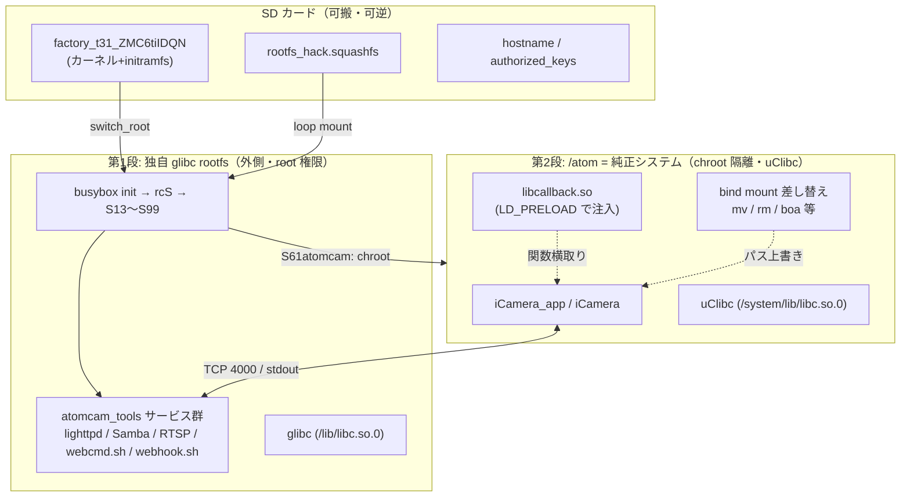
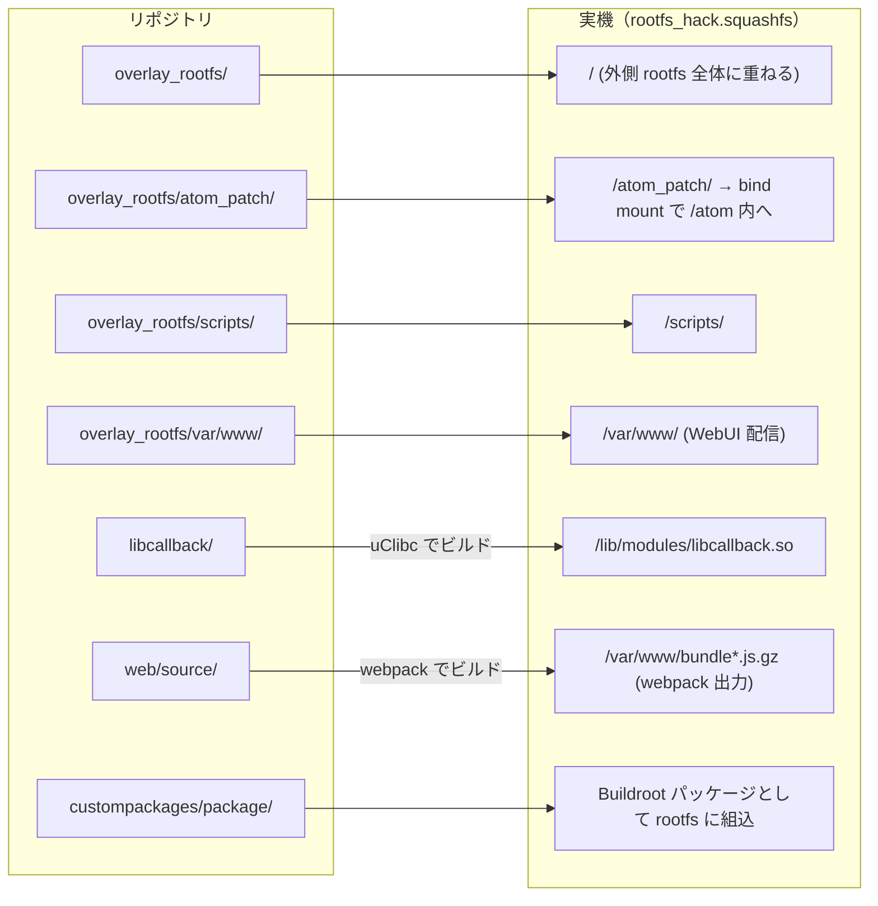

# 01. 全体アーキテクチャ

> **この文書が答える問い**: atomcam_tools は、純正ファームウェアを書き換えずに、どうやってカメラへ機能を追加しているのか？
> **前提として読む文書**: なし（ここが起点）
> **関連する既存文書**: [`../README.md`](../README.md)（ユーザー向け機能一覧）, [`../build.md`](../build.md)（ビルド手順とコンポーネント断片説明）

---

## 1. 設計思想 — なぜ純正ファームウェアを改変しないのか

atomcam_tools は、ATOMCam / ATOMCam2 / AtomSwing / WyzeCamV3 のような Ingenic T31 SoC 搭載カメラに、RTSP 配信・NAS 保存・WebHook・タイムラプス等の機能を追加する。しかしその方法は、**カメラ内蔵フラッシュ上の純正ファームウェアを一切書き換えない**という点で特徴的である。

拡張機能はすべて **SD カードに置いた 4 ファイル**（[02. ビルドシステム](./02-build-system.md) 参照）として供給され、起動時に読み込まれる。この設計には次の利点がある。

- **可逆性**: SD カードを抜けば純正の挙動に戻る。フラッシュ書き換えによる文鎮化リスクを避けられる。
- **純正機能の温存**: 純正カメラアプリ `iCamera_app`（Wyze では `iCamera`）はそのまま動作させ、クラウド連携・モバイルアプリ・AI 検知といった純正機能を殺さない。追加機能はその「隣」に注入する。
- **保守性**: 純正 FW アップデートが来ても、SD カード側を追従させれば対応できる（対応 FW バージョンは [`../README.md`](../README.md) を参照）。

セキュリティ上の注意事項（SSH 鍵の扱い、Samba のゲスト共有など）は [`../README.md`](../README.md) の「セキュリティに関わる重要事項」に集約されている。本 docs 群は設計原理に集中し、そちらは再掲しない。

---

## 2. 二段構えアーキテクチャ

atomcam_tools の核心は、**2 つの段階で純正システムを「乗っ取り」つつ「温存」する**構造にある。

### 第 1 段: カーネル + initramfs の差し替えによる SD カード rootfs 化

純正の更新機構は、SD カード上の `factory_t31_ZMC6tiIDQN` という名前のファイルを「工場出荷ファームウェア」として認識し、内蔵フラッシュへ書き込む。atomcam_tools はこの名前を借りて、**独自ビルドしたカーネル + initramfs** を送り込む。

起動すると、カーネルに内蔵された initramfs の `/init`（[`../initramfs_skeleton/init`](../initramfs_skeleton/init)）が、SD カード上の `rootfs_hack.squashfs` を `switch_root` でルートファイルシステムに切り替える。これにより、純正 rootfs ではなく **Buildroot で生成した独自の glibc Linux 環境**が起動する。詳細は [03. 起動シーケンス](./03-boot-sequence.md)。

### 第 2 段: 純正システムの /atom への chroot 隔離と機能注入

独自 rootfs が起動した後、純正システム一式を `/atom` ディレクトリ以下にマウントして組み立て直し、`chroot /atom` の中で純正カメラアプリを起動する。純正システムは「監獄」に隔離され、その外側に atomcam_tools のツール群（lighttpd, Samba, RTSP サーバ等）が広がる。

隔離した純正システムへの機能注入は、2 つの技法で行う。

1. **bind mount による差し替え**: 純正の `mv` / `rm` / `boa`(Web サーバ) / WiFi 再起動スクリプト等を、`/atom_patch/` 以下の改変版で上書きする（[`../overlay_rootfs/etc/init.d/S61atomcam`](../overlay_rootfs/etc/init.d/S61atomcam)）。
2. **LD_PRELOAD による関数注入**: 純正 `iCamera_app` を `LD_PRELOAD=libcallback.so` 付きで起動し、ライブラリ関数レベルで挙動に割り込む（[04. libcallback による機能注入](./04-libcallback-injection.md)）。

> **この図は docs 全体の看板図**である。以降の各文書は、この図のどこを詳述しているかを冒頭で示す。

---

## 3. 二重 libc 構成 — glibc（外側）と uClibc（内側）

このプロジェクトを理解するうえで最も重要な事実の 1 つが、**2 種類の C ライブラリが同居している**ことである。

| | 外側 rootfs | 内側 /atom（純正） |
|---|---|---|
| C ライブラリ | glibc | uClibc |
| ビルド元 | Buildroot 2016.02 標準ツールチェイン | crosstool-NG 1.26.0 で別途構築 |
| libc の実体パス | `/lib/libc.so.0` | `/system/lib/libc.so.0`（chroot 内視点） |
| 動く主体 | atomcam_tools の全サービス | `iCamera_app` とその周辺 |

純正 `iCamera_app` は uClibc でビルドされている。ここに割り込む `libcallback.so` も**必ず uClibc 環境でビルドしなければ ABI が合わない**。そのため atomcam_tools は、Buildroot 標準の glibc ツールチェインとは別に、crosstool-NG で uClibc クロスコンパイラ（`mipsel-ingenic-linux-uclibc-`）を用意している（[`../buildscripts/setup_buildroot.sh:18-38`](../buildscripts/setup_buildroot.sh)、詳細は [02. ビルドシステム](./02-build-system.md)）。

`libcallback.so` は uClibc 側の世界に属し、その中で `dlopen("/lib/libc.so.0")` して純正が使う libc 関数の実体を取得する（[04. libcallback による機能注入](./04-libcallback-injection.md) のフック技法 ①）。

---

## 4. リポジトリ ⇔ 実機パスの対応

ソースツリーのどのディレクトリが、実機上のどこに配置されるかを把握しておくと、改造時の見通しが良い。

| リポジトリ | 実機パス | 備考 |
|---|---|---|
| `overlay_rootfs/` | 外側 rootfs 全体 | Buildroot の `BR2_ROOTFS_OVERLAY` で上書き |
| `overlay_rootfs/atom_patch/` | `/atom_patch/` | `S61atomcam` が bind mount で `/atom` 内へ被せる |
| `overlay_rootfs/scripts/` | `/scripts/` | 運用シェルスクリプト群（[03](./03-boot-sequence.md)/[05](./05-webui-dataflow.md) で詳述） |
| `overlay_rootfs/var/www/` | `/var/www/` | lighttpd のドキュメントルート・CGI |
| `libcallback/` | `/lib/modules/libcallback.so` | uClibc でビルド（[`../buildscripts/local_build.sh:15-26`](../buildscripts/local_build.sh)） |
| `web/source/` | `/var/www/bundle*.js.gz` | webpack で production ビルド（[`../buildscripts/local_build.sh:28-38`](../buildscripts/local_build.sh)） |
| `custompackages/package/` | rootfs 内各所 | go2rtc / v4l2rtspserver / lighttpd 等の追加パッケージ |

---

## 5. 主要な実行主体と権限

システムには権限の異なる複数の実行主体が同居しており、これが [05. WebUI データフロー](./05-webui-dataflow.md) の多段構成の理由になる。

| 実行主体 | 権限 | 環境 | 役割 |
|---|---|---|---|
| busybox init / init.d スクリプト | root | 外側 glibc | 起動制御・各サービス起動（[03](./03-boot-sequence.md)） |
| `iCamera_app` / `iCamera` | 一般 | 内側 uClibc（chroot `/atom`） | 純正カメラ機能。`libcallback.so` が注入される |
| lighttpd + CGI | `www-data` | 外側 glibc | WebUI のバックエンド。**システム制御は直接できない** |
| `webcmd.sh` | root | 外側 glibc | CGI が実行できない特権操作を代行する常駐デーモン |

`www-data` 権限の CGI が、reboot やファイル削除といった特権操作をどうやって実行するか——その答えが名前付き FIFO 経由の `webcmd.sh` への委譲であり、[05. WebUI データフロー](./05-webui-dataflow.md) の中心テーマである。

---

## 次に読む

- 成果物がどう作られるか → [02. ビルドシステム](./02-build-system.md)
- 成果物がどう起動し隔離環境を作るか → [03. 起動シーケンス](./03-boot-sequence.md)
- 隔離環境の上で機能をどう注入するか → [04. libcallback による機能注入](./04-libcallback-injection.md)
