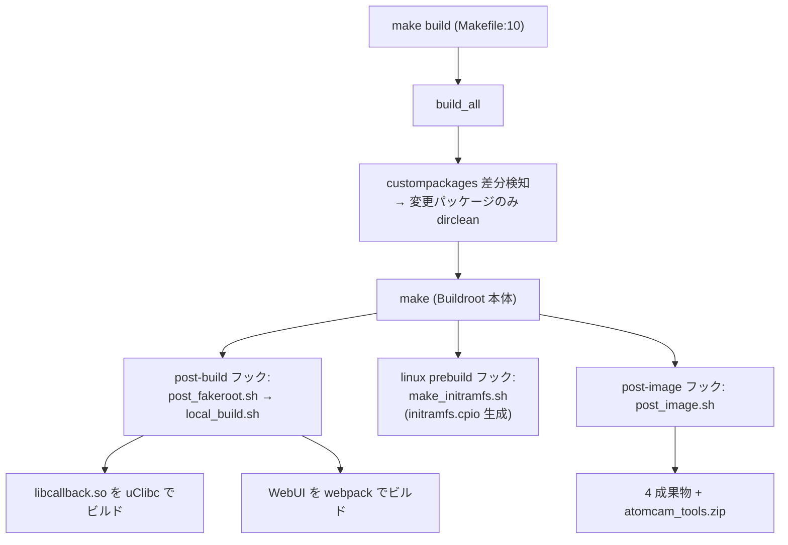
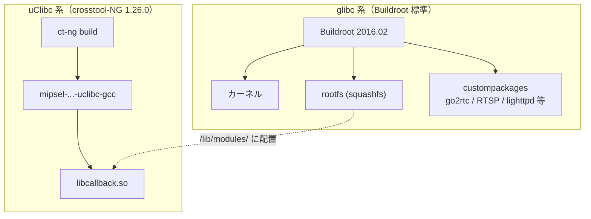

# 02. ビルドシステム

> **この文書が答える問い**: `make` を叩くと、内部で何が起き、SD カードに置く 4 ファイルはどう生成されるのか？
> **前提として読む文書**: [01. 全体アーキテクチャ](./01-architecture.md)（二重 libc 構成を理解しておくこと）
> **関連する既存文書**: [`../build.md`](../build.md)（ビルドコマンドの逐語手順と「何を変えたらどこをリビルド」早見）

本文書は**ビルドの内部フロー（設計）**に集中する。実際に叩くコマンド手順・環境構築の逐語は [`../build.md`](../build.md) にあるので、そちらを一次情報源としてリンクで飛ばす。

---

## 1. ビルドの全体パイプライン

ビルドは Docker コンテナ内で完結する。ホスト側の入口は [`../Makefile`](../Makefile) の `build` ターゲット（macOS では事前に `make lima` で Lima VM を起動）。

```text
make build
  └─ docker-compose exec builder /src/buildscripts/build_all   (Makefile:10)
```

Docker イメージ自体は初回のみ `make docker-build` で構築し、その中で `setup_buildroot.sh` が走る。全体像は次の 2 フェーズに分かれる。

- **フェーズ A（初回・イメージ構築時）**: [`setup_buildroot.sh`](../buildscripts/setup_buildroot.sh) が Buildroot 展開・uClibc クロスコンパイラ構築・Node.js/Go 導入を行う。
- **フェーズ B（毎回のビルド）**: [`build_all`](../buildscripts/build_all) が差分検知して `make` を回し、Buildroot のフックが `local_build.sh` / `post_image.sh` を呼ぶ。



---

## 2. Docker / Lima ビルド環境

| ファイル | 役割 |
|---|---|
| [`../Dockerfile`](../Dockerfile) | Ubuntu 16.04 ベースのビルド環境。Buildroot 展開と `setup_buildroot.sh` 実行 |
| [`../docker-compose.yml`](../docker-compose.yml) | `builder` サービス定義。`/src` にリポジトリをマウント |
| [`../lima-docker.yml`](../lima-docker.yml) | macOS 用。Docker を動かす Lima VM の定義（`make lima`） |

`Makefile` の `build` は、コンテナが未起動なら `docker-compose up -d` してから `build_all` を exec する（[`../Makefile:7-10`](../Makefile)）。ビルドログは `rebuild_<日時>.log` に tee される。

---

## 3. 初回セットアップ: setup_buildroot.sh の内部

[`../buildscripts/setup_buildroot.sh`](../buildscripts/setup_buildroot.sh) は、ビルドに必要な 3 系統のツールチェイン・ランタイムを準備する。

### 3.1 Buildroot 展開と defconfig 適用（`:5-16`）

- `custompackages/package/*` を Buildroot の `package/` へコピー。
- パッチ適用: `add_fp_no_fused_madd.patch`, `linux_makefile.patch`（[`../patches/`](../patches)）。
- `configs/atomcam_defconfig` を `make atomcam_defconfig` で適用。この defconfig が「カーネルソース = Wyze 公開の Linux 3.10、rootfs = SquashFS4(gzip)、`BR2_ROOTFS_OVERLAY=/src/overlay_rootfs`、initramfs をカーネル内蔵」といった要点を決める。

### 3.2 uClibc クロスコンパイラの構築（`:18-38`）— 二重 libc の実装

[01. 全体アーキテクチャ](./01-architecture.md) で述べた「二重 libc」の実体がここにある。Buildroot 本体は glibc ツールチェインを生成するが、純正 `iCamera_app` は uClibc でビルドされているため、`libcallback.so` を注入するには **uClibc 版クロスコンパイラが別途必要**になる。

```text
crosstool-ng 1.26.0 を configure/make/install
  └─ configs/crosstools_config を .config として ct-ng build
       └─ /atomtools/build/cross/mips-uclibc/bin/mipsel-ingenic-linux-uclibc-*
            └─ sysroot に patches/linux_uclibc_hevc.patch を適用
```

これにより 2 系統の gcc プレフィックスが揃う（[`../build.md`](../build.md) 「Docker環境」節も参照）。

| ツールチェイン | プレフィックス | 用途 |
|---|---|---|
| glibc（Buildroot 生成） | `mipsel-ingenic-linux-gnu-` | 外側 rootfs 全体 |
| uClibc（crosstool-NG） | `mipsel-ingenic-linux-uclibc-` | `libcallback.so` のみ |



### 3.3 Node.js / Go の導入（`:40-62`）

- **Node.js v16.20.2**: WebUI（`web/`）を webpack でバンドルするため。実機（MIPSEL）では Node は動かないので、ビルド時にフロントを静的資産化する（[05. WebUI データフロー](./05-webui-dataflow.md) 参照）。
- **Go 1.22.3**: `custompackages` の go2rtc（WebRTC / HomeKit 用）をビルドするため。

---

## 4. 反復ビルド: build_all の差分検知

[`../buildscripts/build_all`](../buildscripts/build_all) は 2 回目以降の `make build` で走る。

1. `output/target` をクリーンし、glibc の `libgcc_s` / `libatomic` / `libstdc++` を staging から再配置（`:6-9`）。
2. `atomcam_defconfig` を `.config` として `make oldconfig`。
3. **`custompackages/package/*` を 1 つずつ `diff` し、変更があったパッケージだけ `make <pkg>-dirclean`**（`:14-21`）。これで全体を作り直さず増分ビルドできる。
4. `make` 実行 → Buildroot が各フックを呼ぶ。

---

## 5. 成果物生成の要 — フック 3 種

Buildroot の `make` は、defconfig で登録されたフックスクリプトを所定のタイミングで呼ぶ。

### 5.1 local_build.sh（post-build、fakeroot 前）

[`../buildscripts/local_build.sh`](../buildscripts/local_build.sh) が atomcam_tools 固有の 2 大成果物をビルドする。

- **純正 init.d の除去**（`:4-7`）: Buildroot 標準の `S20urandom` / `S40network` / `S50sshd` / `S50lighttpd` を削除し、独自版に置換する土台を作る。
- **libcallback.so のビルド**（`:15-26`）: uClibc クロスコンパイラで [`../libcallback/`](../libcallback) を `make` し、`$TARGET_DIR/lib/modules/libcallback.so` へ配置。
- **WebUI のビルド**（`:28-38`）: `web/source` を webpack production ビルドし、`frontend/*` を `$TARGET_DIR/var/www` へコピー。

### 5.2 make_initramfs.sh（linux prebuild）

[`../buildscripts/make_initramfs.sh`](../buildscripts/make_initramfs.sh) が [`../initramfs_skeleton/`](../initramfs_skeleton) を元に `initramfs.cpio` を生成する。これは defconfig の `CONFIG_INITRAMFS_SOURCE` によって**カーネルイメージに内蔵**される（[03. 起動シーケンス](./03-boot-sequence.md) Stage 1 で使われる `/init` の実体）。

### 5.3 post_image.sh（post-image）— 4 ファイルへの最終加工

[`../buildscripts/post_image.sh`](../buildscripts/post_image.sh) が最終成果物を組み立てる（全 11 行）。

```sh
cp -dpf uImage.lzma factory_t31_ZMC6tiIDQN   # カーネル+initramfs を純正更新名に偽装
mv rootfs.squashfs rootfs_hack.squashfs       # rootfs をリネーム
echo "atomcam" > hostname                     # デフォルトホスト名
touch authorized_keys                         # 空の SSH 鍵ファイル
zip -ry /src/atomcam_tools.zip <4ファイル>     # zip 化
cp -f factory_t31_ZMC6tiIDQN rootfs_hack.squashfs /src/target  # target/ にもコピー
```

---

## 6. 成果物 4 ファイルの正体

| ファイル | 実体 | カメラ上での役割 |
|---|---|---|
| `factory_t31_ZMC6tiIDQN` | `uImage.lzma`（LZMA 圧縮カーネル + 内蔵 initramfs） | 純正更新機構が「工場出荷ファーム」として検出し内蔵フラッシュへ書き込む。実質はカーネル差し替え |
| `rootfs_hack.squashfs` | Buildroot squashfs + `overlay_rootfs` | `/init` が `switch_root` でルート化する独自 rootfs |
| `hostname` | テキスト | デバイス名（デフォルト `atomcam`）。編集で mDNS 名を変更 |
| `authorized_keys` | SSH 公開鍵 | `cat ~/.ssh/id_rsa.pub >> target/authorized_keys` で SSH ログインを許可 |

この 4 ファイルは `atomcam_tools.zip` に同梱され、SD カードのルートに展開して使う。OTA 更新時は SD カードの `update/atomcam_tools.zip` として置くと、`/init` が展開・検証・適用する（[03. 起動シーケンス](./03-boot-sequence.md) Stage 1）。

---

## 7. custompackages の位置づけ

[`../custompackages/package/`](../custompackages/package) には、Buildroot に追加する独自パッケージ定義が入る。機能とパッケージの対応の目安:

| 機能 | パッケージ |
|---|---|
| RTSP 配信 | `v4l2rtspserver`, `v4l2loopback`, `live555` |
| WebRTC / HomeKit | `go2rtc` |
| WebUI 配信 | `lighttpd` |
| 映像/音声処理 | `ffmpeg`, `fdk-aac`, `opus`, `ingenic_videocap` |
| WiFi | `atbm_wifi` |
| initramfs/rootfs ツール | `busybox-init`, `exfatprogs-init` |

パッケージを追加・変更したときのリビルド手順（`make menuconfig` / `make <pkg>-rebuild` 等）は [`../build.md`](../build.md) 「各種変更時のビルド方法」を参照。

---

## 次に読む

- 生成した 4 ファイルがどう起動するか → [03. 起動シーケンス](./03-boot-sequence.md)
