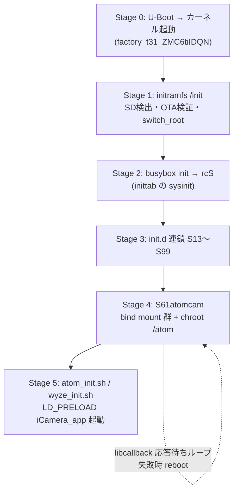
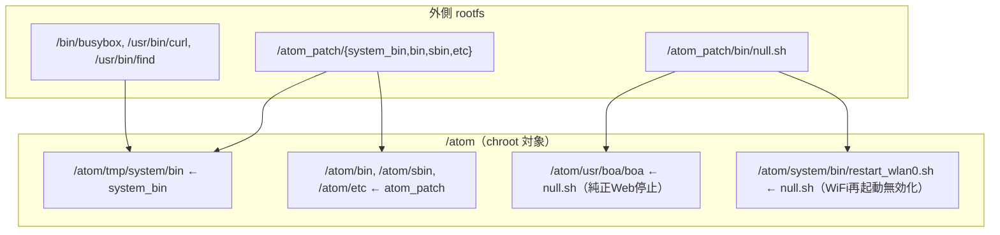

# 03. 起動シーケンス

> **この文書が答える問い**: 電源投入から純正 `iCamera_app` が `libcallback.so` 付きで起動するまで、何が順に起こるのか？
> **前提として読む文書**: [01. 全体アーキテクチャ](./01-architecture.md), [02. ビルドシステム](./02-build-system.md)（4 成果物を理解しておくこと）
> **関連する既存文書**: [`../build.md`](../build.md)（各 init.d / scripts の 1 行説明。本書はそれを再掲せず順序と要所に集中）

本書は [01 の看板図](./01-architecture.md#2-二段構えアーキテクチャ) の「第 1 段 → 第 2 段」への移行を時系列で追う。

---

## 1. 起動全体像

Stage 0〜1 は glibc 化する前の initramfs（最小 busybox）、Stage 2〜4 は外側 glibc rootfs、Stage 5 から chroot 内の uClibc 環境に入る。

---

## 2. Stage 1: initramfs /init

実体は [`../initramfs_skeleton/init`](../initramfs_skeleton/init)（カーネルに内蔵。[02](./02-build-system.md) の `make_initramfs.sh` が生成）。

### 2.1 SD カード検出とマウント（`:4-20`）

devtmpfs / proc / sysfs をマウント後、`/dev/mmcblk0p2` が exfat かどうかで分岐する。

- **exfat 構成**: `p1`=vfat を `/boot`、`p2`=exfat を `/rootfs` にマウント（大容量 SD 向け）。
- **単一構成**: `p1`=vfat を `/rootfs` にマウントし、`/boot` はそこへ bind。

`/boot/initramfs-debug` があればここで shell に落ちる（`:22`）。

### 2.2 OTA 更新の検証と適用（`:24-71`）

SD カードの `update/atomcam_tools.zip` があれば展開し、各ファイルを**ヘッダ埋め込みサイズと実ファイルサイズが一致するか検証**してから所定位置へ移す。この検証が壊れた更新の適用を防ぐ。

| 対象 | サイズ検証 | 適用先 |
|---|---|---|
| `rootfs_hack.squashfs` | ヘッダ `0x28` の値を 4096 境界に丸めた値と照合（`:39-48`） | `/rootfs/` |
| `rootfs_hack.ext2` | ヘッダ `0x404` の値 ×1024 と照合（`:29-38`） | `/rootfs/`（旧形式） |
| `factory_t31_ZMC6tiIDQN` | ヘッダ `0x0c` の値 +64 と照合（`:50-59`） | `/boot/`。適用後 `exit` で **panic→リブート**（カーネル差し替えのため） |

> squashfs と ext2 が両方存在する場合はサイズ検証で正しい方を残す（`:61-71`）。通常は squashfs。

### 2.3 switch_root（`:73-82`）

`rootfs_hack.squashfs` を loop マウントで `/newroot` にし、`dev` / `sys` / `proc` / `rootfs`(→`/media/mmc`) / `boot` を `--move` してから `switch_root /newroot /sbin/init` を実行する。ここで**独自 glibc rootfs が起動**する。

---

## 3. Stage 2: busybox init と rcS

[`../overlay_rootfs/etc/inittab`](../overlay_rootfs/etc/inittab) の `sysinit` が、基本マウント・ホスト名設定の後に [`../overlay_rootfs/etc/init.d/rcS`](../overlay_rootfs/etc/init.d/rcS) を起動する。`rcS` は `/etc/init.d/S??*` を番号順に実行する。シリアルコンソール（`ttyS1`）には getty が上がる。

---

## 4. Stage 3: init.d 連鎖（S13〜S99）

各スクリプトの 1 行説明は [`../build.md`](../build.md) にあるため再掲しない。ここでは**起動順に依存関係がある要所**だけを解説する。

| 順 | スクリプト | 役割（順序上の意味） |
|---|---|---|
| S13 | `S13gpio` | GPIO 初期化（LED 制御等の土台） |
| S15 | `S15swap` | SD カード上に swap を作成・有効化。以降のメモリ確保の前提 |
| S16 | `S16fwupdate` | **純正 FW 更新の代行**（下記 4.1） |
| S17 | `S17hackini` | `hack.ini` を読み `/tmp/hack.ini` に展開。以降の各サービスが参照する設定を用意（[06](./06-configuration.md)） |
| S20 | `S20mountfs` | **純正システムを `/atom` に組み立てる**（下記 4.2）。第 2 段の土台 |
| S21 | `S21rootkeys` | SD カードの `authorized_keys` を `/root/.ssh` へ |
| S40〜S43 | hostname / network / ntpd / timezone | ネットワークと時刻。`network_init.sh` を使用 |
| S53 | `S53crond` | cron 起動（reboot/timelapse スケジュールの実行基盤、[06](./06-configuration.md)） |
| S55 | `S55sshd` | ホスト鍵生成し sshd 起動（`authorized_keys` が無ければ skip） |
| S60 | `S60webhook` | 名前付き FIFO `/var/run/atomapp` を作り `webhook.sh` 起動（[04](./04-libcallback-injection.md) のイベント出力を受ける） |
| **S61** | **`S61atomcam`** | **純正アプリ起動の核心**（下記 5 章）。S20 のマウントと S60 の FIFO が前提 |
| S62 | `S62webcontrol` | `webcmd.sh`（root デーモン）と `cruise.sh` を起動（[05](./05-webui-dataflow.md)） |
| S70 | `S70lighttpd` | WebUI 用 lighttpd 起動（[05](./05-webui-dataflow.md)） |
| S75 | `S75rtspserver` | v4l2rtspserver 起動（[04](./04-libcallback-injection.md) の video/audio キャプチャが前提） |
| S91 | `S91smb` | Samba |
| S99 | `S99bootlog` | 起動ログ記録・デフォルトルータ保存 |

### 4.1 S16fwupdate — 純正 FW 更新の代行

純正アプリからの FW アップデートシーケンスが実行中の場合、その mtd フラッシュ書き込み処理を代行する（`FWGRADEUP` 種別で mtd1/2/3 の消去・書き込みを分岐）。SD カードを抜かずに純正 FW 更新できるのはこの仕組みによる。

### 4.2 S20mountfs — 純正システムの /atom 組み立て

overlayfs が使えないため bind mount で構成する。純正の `atom_root.squashfs`（mtd2 から抽出）を `/atom` に、mtd3 を `/atom/system` に、SD カード上の `configs` / `tools_configs`(ext2) をマウントし、SSH 鍵・lighttpd・wpa_supplicant・crontab 等を bind mount で組み込む。ここで初めて `/atom` が「動かせる純正システム」になる。

---

## 5. Stage 4: S61atomcam — chroot 隔離の核心

[`../overlay_rootfs/etc/init.d/S61atomcam`](../overlay_rootfs/etc/init.d/S61atomcam) が第 2 段の中心。`start` の流れ:

### 5.1 外側ツールを /atom 内へ bind mount（`:18-38`）

純正バイナリを改変版・外側ツールで上書きする。

`null.sh` を純正 Web サーバ `boa` と `restart_wlan0.sh` に被せることで、純正のこれらを無効化する（`:37-38`）。これは atomcam_tools 側の lighttpd / ネットワーク管理と衝突させないため。

### 5.2 v4l2loopback 挿入と watermark 準備（`:43-45`）

`insmod v4l2loopback.ko video_nr=0,1,2` で仮想ビデオデバイスを 3 つ作る。[04](./04-libcallback-injection.md) の video キャプチャがここへフレームを流し、[05](./05-webui-dataflow.md) の RTSP 配信が読み出す。

### 5.3 機種判定と chroot（`:47-53`）

`/atom/configs/.product_config` の `PRODUCT_MODEL` を読み、Wyze なら `wyze_init.sh`、それ以外は `atom_init.sh` を **chroot `/atom` の中で実行**する（機種差分は [07](./07-device-variants.md)）。

### 5.4 libcallback 応答確認ループ（`:56-71`）

chroot 起動後、`/scripts/cmd audio` を最大 20 回（0.5 秒間隔）ポーリングし、`libcallback.so` の TCP 4000 が応答するか確認する。20 回失敗したら `reboot` する。応答確認後 `set_icamera_config.sh` とタイムラプス設定を流す。`iCamera_app` 起動でウォッチドッグが走るため、以降 `iCamera_app` / `assis` は停止不可になる。

> `stop` 側（`:76-105`）は umount を起動と逆順で行い、マウントの依存関係を崩さず後始末する。

---

## 6. Stage 5: LD_PRELOAD 付き iCamera_app 起動

chroot 内で実行される [`../overlay_rootfs/atom_patch/system_bin/atom_init.sh`](../overlay_rootfs/atom_patch/system_bin/atom_init.sh)（Wyze は `wyze_init.sh`）。ここから **uClibc 環境**に入る。

1. `PATH` / `LD_LIBRARY_PATH` を chroot 内向けに設定（`:4-5`）。
2. ISP / audio / avpu 等の純正カーネルモジュールを `insmod`（`:16-27`。機種で引数が変わる → [07](./07-device-variants.md)）。
3. `assis` / `hl_client` を起動。
4. **`LD_PRELOAD=/tmp/system/lib/modules/libcallback.so /system/bin/iCamera_app` を起動**（`:34`）。標準出力は名前付き FIFO `/var/run/atomapp` に流し、S60 の `webhook.sh` がイベントを拾う（[04](./04-libcallback-injection.md)）。

この 1 行が、[04. libcallback による機能注入](./04-libcallback-injection.md) の全機能が有効になる瞬間である。

---

## 次に読む

- iCamera_app に何が注入され、どう制御されるか → [04. libcallback による機能注入](./04-libcallback-injection.md)
