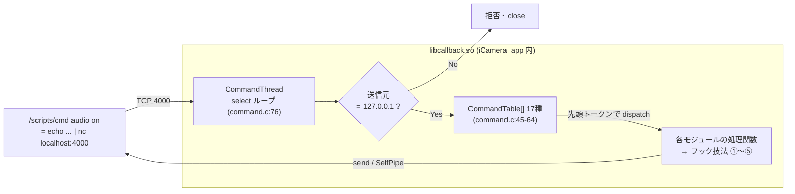

# 04. libcallback による機能注入

> **この文書が答える問い**: `LD_PRELOAD=libcallback.so` は、純正バイナリを 1 バイトも書き換えずに、どうやって挙動を乗っ取っているのか？
> **前提として読む文書**: [01. 全体アーキテクチャ](./01-architecture.md)（二重 libc）, [03. 起動シーケンス](./03-boot-sequence.md) Stage 5（LD_PRELOAD 起動の瞬間）
> **関連する既存文書**: [`../libcallback/libcallback_hook.md`](../libcallback/libcallback_hook.md)（各モジュールのコマンド書式と hook point の辞書。**個々のコマンド仕様はこちらが一次情報源**）

本書は「**フックの技術手法の分類**」に集中する。「各コマンドが何をするか・どう書くか」は上記 `libcallback_hook.md` にあるので再掲しない。ビルド方法は [02. ビルドシステム](./02-build-system.md) を参照。

---

## 1. なぜ LD_PRELOAD が効くのか

`LD_PRELOAD` に指定した共有ライブラリは、他のどのライブラリよりも先にロードされる。動的リンカがシンボルを解決するとき、`libcallback.so` が同名の関数を定義していれば**そちらが優先的に束縛される**（シンボルインターポジション）。これにより、純正 `iCamera_app` が呼ぶ libc / SDK 関数を横取りできる。

ただし限界もある。**ライブラリのエクスポート表に現れない内部関数は、この方法では置き換えられない**（[`../libcallback/libcallback_hook.md`](../libcallback/libcallback_hook.md) 冒頭に明記）。libcallback はこの限界を、後述の技法 ④⑤ のような「メモリ上を直接探る」手段で補っている。

`libcallback.so` は uClibc 側の世界に属し、その中で純正が使う関数の実体を `dlopen`/`dlsym` で取得する（[01](./01-architecture.md) の二重 libc を参照）。

---

## 2. 初期化 — constructor 群

libcallback は複数の `__attribute__((constructor))` を持ち、`iCamera_app` の `main` より前に走る。中核は [`../libcallback/command.c:223`](../libcallback/command.c) の `command_init`。

```c
static void __attribute ((constructor)) command_init(void) {
  unsetenv("LD_PRELOAD");                      // 子プロセスへの伝播を止める
  char *p = getenv("PRODUCT_MODEL");
  if(!strcmp(p, "WYZE_CAKP2JFUS")) wyze = 1;   // 機種フラグ（→07）
  if(!strcmp(p, "ATOM_CAKP1JZJP")) swing = 1;
  ...
  pthread_create(&thread, NULL, CommandThread, NULL);  // port 4000 サーバ起動
}
```

- **`unsetenv("LD_PRELOAD")`**: `iCamera_app` が起動する子プロセス（`curl` など）にまで libcallback が注入されるのを防ぐ。
- **機種フラグ**: `wyze` / `swing` グローバルを設定。各モジュールが `extern` 参照して分岐する（[07. 機種差分](./07-device-variants.md)）。

各モジュールも自前の constructor で `dlsym` による実体取得を済ませておく（技法 ①）。

---

## 3. 5 つのフック技法

libcallback の各 `.c` は、次の 5 パターンのいずれか（または複合）で純正に割り込む。**すべて実コードで確認済み**。

### 技法① シンボルインターポジション + dlsym で実体取得（最多数）

同名の関数を再定義し、constructor で `dlopen`/`dlsym` して原関数ポインタを保持、独自処理後に原関数を呼ぶ。最も基本的なパターン。

```c
// user_config.c:20  （constructor 内）
original_strncmp = dlsym(dlopen("/lib/libc.so.0", RTLD_LAZY), "strncmp");
```

libc の実体は uClibc の `/lib/libc.so.0`、純正 SDK は `/system/lib/liblocalsdk.so` などから取得する。**代表**: `mmc_mount.c`（SD 二重 mount 抑止。dlsym で原関数を取得し条件付きで呼ぶ）, `freopen.c`, `opendir.c` / `remove.c`（timelapse イベント出力）, `gmtime_r.c`（Swing 追尾中の AI 無効化）, `get_jpeg.c`, `video_control.c`（`local_sdk_video_set_kbps` 等）, `watermark.c`（`IMP_OSD_SetRgnAttr`）, `wait_motion.c`（`local_sdk_video_osd_update_rect`）。

> **亜種（no-op 上書き）**: `mmc_format.c`（フォーマット無効化）と `usb_power.c`（USB VBUS 制御無視）は、同名関数を定義してシンボルを奪う点は技法①と同じだが、**dlsym で原関数を取らず、何もせず即 `return` する完全な上書き**である。純正の破壊的動作を殺す用途では原関数を呼ぶ必要がないため。

### 技法② コールバック登録関数の横取りで映像/音声フレームを分岐取得

技法 ① の応用。SDK の「コールバック登録関数」をフックし、`iCamera_app` が渡す本来のコールバックを保存して**自前のコールバックにすり替える**。フレーム到来時に横取り処理をしてから本来のコールバックを呼ぶので、純正の録画・配信を一切阻害しない。

```c
// video_callback.c:193-204
int local_sdk_video_set_encode_frame_callback(int sch, void *callback) {
  ...
  video_capture[ch].callback = callback;      // 本来のコールバックを保存
  callback = video_capture[ch].capture;       // 自前のものにすり替え
  return real_local_sdk_video_set_encode_frame_callback(sch, callback);
}

// video_capture[ch].capture の実体 video_encode_capture():177-178
if(video_capture[ch].fd >= 0) write(video_capture[ch].fd, frames->buf, frames->length);  // v4l2loopback へ
return (video_capture[ch].callback)(frames);  // 本来のコールバックへ戻す
```

**代表**: `video_callback.c`（H264/HEVC を v4l2loopback `/dev/video0-2` へ）, `audio_callback.c`（PCM を ALSA loopback へ）。これが [05](./05-webui-dataflow.md) の RTSP 配信の映像源になる。

### 技法③ インラインアセンブラで MIPS レジスタを盗み見る

フック関数の中で、C では触れない CPU レジスタをインラインアセンブラで読む。呼び出しコンテキストを推定するために使う。

```c
// curl.c:114-118  戻りアドレス $31(ra) を取得
unsigned int ra = 0;
asm volatile(
  "ori %0, $31, 0\n"
  : "=r"(ra)
);
```

`alarm_config.c` では `memset` フック内で `$16`/`$17`（それぞれ `$s0`/`$s1`）を読み、テーブル初期化ループのインデックスから alarmConfig テーブル先頭を捕捉する。**代表**: `curl.c`, `alarm_config.c`。

### 技法④ /proc/maps + MIPS 命令パターンマッチで内部関数を発見（最高度）

エクスポートされていない内部関数を、**メモリ上の機械語命令を走査して**見つけ出す。`property.c` の constructor が実装する（[`../libcallback/property.c:286-378`](../libcallback/property.c)）。

1. `/proc/<pid>/maps` から `iCamera_app` のロードアドレスを取得（`:289-302`）。
2. `.rodata` 中の書式文字列 `"[%s,%04d]----- p2p recv protocol set property -----\n"` を線形探索（`:304-310`）。
3. その文字列を参照する `lui`/`addiu` 命令ペアを `.text`（`_init`〜`_fini` 間）で探し、直後の `jal` から `P2P_ReceiveProtocol_Parse` 関数の先頭（`addiu sp,sp,-x` = `0x27bd....`）を逆算（`:330-354`）。
4. さらにそれを `jal` で呼ぶ箇所を探し、`ProtocolSetProperty` 関数ポインタを確定（`:360-373`）。

こうして得た関数を `void ProtocolSetProperty(char *buf, char *req, char *res)` として、JSON でモバイルアプリ相当の API を直接叩く。**`iCamera_app` の実装に依存するため、純正 FW 更新で失効し得る**（`gmtime_r.c` のコメントにも同様の注意あり）。**代表**: `property.c`。

### 技法⑤ 特定引数の strncmp 横取りで設定テーブル基点を取得

`iCamera_app` が既知のキー文字列で `strncmp` を呼ぶ瞬間を捉え、その引数ポインタから設定テーブルの先頭を逆算する。

```c
// user_config.c:23-37
int strncmp(const char *s1, const char *s2, size_t size) {
  if(!configData && !strcmp(s1, "indicator")) {   // 既知キーの照合を待つ
    configData = (unsigned int *)(s1 - 4);          // テーブル内キーの 4 バイト手前 = レコード先頭
    for(int i = 6; i < 16; i++) { ... configSize = i; ... }  // レコードサイズを推定
  }
  return original_strncmp(s1, s2, size);
}
```

以降は `GetUserConfig`/`SetUserConfig`（`:69-92`）で内部変数を直接 get/set できる。ただし `.user_config` ファイルには書かれない**揮発性**の変更である点に注意（永続化は別途ファイル書き込みが必要）。**代表**: `user_config.c`。

---

## 4. port 4000 コマンドサーバ（command.c）

外部（`/scripts/cmd` や WebUI）は、TCP **4000 番（127.0.0.1 限定）**で libcallback にコマンドを送る。`/scripts/cmd` は実質 `echo "$*" | nc localhost 4000` のラッパー。



- **listen**: `INADDR_ANY:4000`（[`../libcallback/command.c:97-98`](../libcallback/command.c)）だが、accept 時に送信元が `127.0.0.1` でなければ拒否する（`:151-155`）。
- **ディスパッチ**: 受信 1 行目の先頭トークンを `CommandTable`（`:45-64`）と `strcasecmp` で照合し、対応関数を呼ぶ（`:178-191`）。
- **応答**: 同期 `send` か、非同期処理用の self-pipe（`CommandResponse`, `:66-74`）経由。

### コマンド一覧（17 種）

`CommandTable` に登録されたトップレベルコマンドは次の 17 種。**各コマンドの引数書式・意味は [`../libcallback/libcallback_hook.md`](../libcallback/libcallback_hook.md) を参照**（ここでは技法との対応のみ示す）。

`video` / `audio` / `jpeg` / `move` / `waitMotion` / `night` / `aplay` / `curl` / `timelapse` / `mp4write` / `alarm` / `config` / `alarmConfig` / `center` / `property` / `watermark` / `skipRecJpeg`

> `memory.c`（`mem` コマンド）と `printf.c` は [`../libcallback/Makefile:5`](../libcallback/Makefile) と `command.c:63` でコメントアウトされ、**ビルドに含まれない**（デバッグ用の無効モジュール）。

---

## 5. モジュール × フック技法マトリクス

| モジュール | 主たる技法 | 補足 |
|---|---|---|
| `command.c` | ―（コア IF） | port 4000 サーバ・機種判定 |
| `video_callback.c` | ② | H264/HEVC → v4l2loopback |
| `audio_callback.c` | ② | PCM → ALSA loopback |
| `video_control.c` | ① | `set_kbps`/`set_fps`/`IMP_Encoder_CreateChn` |
| `watermark.c` | ① | `IMP_OSD_SetRgnAttr` 横取り |
| `wait_motion.c` | ① | `local_sdk_video_osd_update_rect`（Swing 追尾） |
| `mmc_mount.c` | ① | dlsym で原関数取得・条件付き呼出（SD 二重 mount 抑止） |
| `mmc_format.c` / `usb_power.c` | ①（no-op 上書き） | 原関数を呼ばず即 return し純正の破壊的動作を無効化 |
| `freopen.c` / `setlinebuf.c` | ①/初期化 | stdout 抑止回避・行バッファ化（イベント検知の土台） |
| `opendir.c` / `remove.c` | ① | timelapse イベントを stdout 出力 |
| `get_jpeg.c` | ① | 連続録画時の jpeg 記録抑止 |
| `mp4write.c` | ① | 録画一時ファイルの RAM/SD 切替 |
| `gmtime_r.c` | ① | Swing 追尾中に存在しない曜日を返し AI 無効化 |
| `curl.c` | ③（+①） | アラーム動画 upload の棄却・偽装応答 |
| `alarm_config.c` | ③ | `memset` フック + レジスタで alarmConfig テーブル捕捉（Wyze） |
| `property.c` | ④ | コード走査で P2P API を発見 |
| `user_config.c` | ⑤ | `strncmp` 横取りで設定テーブル基点取得 |
| `audio_control.c` / `audio_play.c` / `jpeg.c` / `motor.c` / `night_light.c` / `timelapse.c` / `alarm_interval.c` / `center.c` | ―（SDK/IMP 直接呼出） | フックせず SDK API を直接使う機能 |

### curl.c の棄却ロジック（技法③の応用例）

動体検知間隔を短縮すると純正クラウドへ頻繁に動画 POST が飛ぶため、`curl.c:136-154` はアラーム URL への upload を **5 分以内（`curl_minimum_alarm_cycle`）または upload 無効時に棄却**し、ダミー応答 `DummyRes` を書き込む。続く `curl_ok:` ラベル（`:167-173`）で `httpcode=200` を偽装してエラーを避ける。これが「動体検知の不感知期間短縮」機能（[`../README.md`](../README.md)）を純正に気付かれず成立させる仕掛けである。

---

## 6. 新しいフックを追加するには

1. `libcallback/<name>.c` を作成し、`command.c` の `extern` 宣言と `CommandTable[]` にコマンドを登録する。
2. [`../libcallback/Makefile:5`](../libcallback/Makefile) の `CC_SRCS` にソースを追加する。
3. libc/SDK 関数をフックする場合は constructor で `dlsym(dlopen(...), ...)` して原関数を保持する（技法①）。
4. 機種差分がある場合は `extern int wyze, swing;` を参照して分岐する（[07. 機種差分](./07-device-variants.md)）。
5. イベントを外部へ通知したい場合は `printf("[webhook] ...")` で stdout に出す（`webhook.sh` が拾う、[05](./05-webui-dataflow.md)）。

---

## 次に読む

- 注入した機能を WebUI からどう叩くか → [05. WebUI データフロー](./05-webui-dataflow.md)
- 機種ごとのフック分岐 → [07. 機種差分](./07-device-variants.md)
