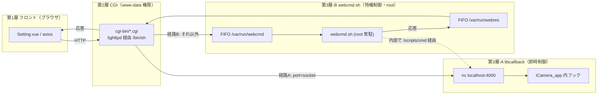
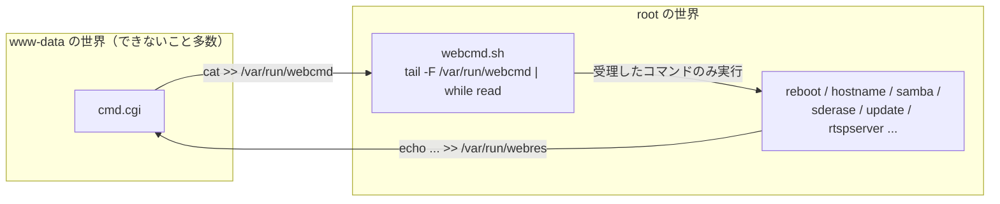
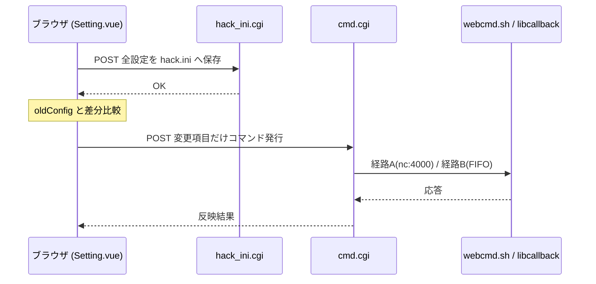

# 05. WebUI データフロー

> **この文書が答える問い**: ブラウザのボタン 1 つが、どういう経路で権限の壁を越えてカメラを制御するのか？
> **前提として読む文書**: [01. 全体アーキテクチャ](./01-architecture.md)（実行主体と権限）, [04. libcallback による機能注入](./04-libcallback-injection.md)（port 4000）
> **関連する既存文書**: [`../build.md`](../build.md)（各 CGI / scripts の 1 行説明。技術スタックの逐語）

本書は **「なぜ多段構成なのか = 権限境界の突破」**に集中する。技術スタックの逐語説明は [`../build.md`](../build.md) 「WebUI」節を参照。

---

## 1. WebUI 技術スタック概観

| 層 | 技術 | 実体 |
|---|---|---|
| フロント | Vue 2.7 + Element UI 2.15 + axios | [`../web/source/vue/Setting.vue`](../web/source/vue/Setting.vue)（画面本体）。webpack で `bundle*.js.gz` にバンドル（[02](./02-build-system.md)） |
| Web サーバ | lighttpd（`www-data`） | [`../overlay_rootfs/etc/lighttpd/lighttpd.conf`](../overlay_rootfs/etc/lighttpd/lighttpd.conf)。port 80、`mod_cgi` で `.cgi` を `/bin/sh` 実行 |
| CGI | `/bin/sh` スクリプト | [`../overlay_rootfs/var/www/cgi-bin/`](../overlay_rootfs/var/www/cgi-bin)（6 本） |

実機は MIPSEL で Node.js が動かないため、**サーバサイド JS は存在しない**。フロントだけをビルド時に静的化し、バックエンドは lighttpd + CGI シェルスクリプトで受ける（[`../build.md`](../build.md)）。`.js` は gzip 圧縮して配信し、lighttpd が `.js` → `.js.gz` に rewrite する（`lighttpd.conf:19-25`）。認証は htdigest（realm `atomcam`）で、`include "auth.conf"` を動的生成して on/off を切り替える（`lighttpd.conf:76-85`、[`../overlay_rootfs/scripts/lighttpd.sh`](../overlay_rootfs/scripts/lighttpd.sh)）。

---

## 2. 3 層データフローの全体像

WebUI は権限の壁を越えるため、**2 つの制御経路**を使い分ける。これが最重要の構造。



- **経路 A（即時・非特権）**: カメラの画質・キャプチャ等、libcallback だけで完結する制御。CGI が直接 `nc localhost:4000` する。
- **経路 B（特権）**: reboot・hostname 変更・Samba 起動・ファイル削除など、`www-data` では実行できない操作。CGI が FIFO にコマンドを書き、**root 権限で常駐する `webcmd.sh`** が代行する。

---

## 3. なぜ 2 経路あるのか — 権限境界の突破

CGI は lighttpd の `www-data` 権限で実行される（`lighttpd.conf:28-29`）。この権限では `reboot`、`/media/mmc` 配下の削除、`hostname` 変更、デーモンの起動/停止といった操作ができない。

そこで [`../overlay_rootfs/scripts/webcmd.sh`](../overlay_rootfs/scripts/webcmd.sh) を **root で常駐**させ（[03](./03-boot-sequence.md) の `S62webcontrol` が起動）、名前付き FIFO を「安全な受け渡し窓口」にする。



`webcmd.sh` は**受け取ったコマンド名を明示的に照合し、許可したものだけ実行する**（未知のコマンドは `syntax error` を返す、`webcmd.sh:195-197`）。これにより、CGI 経由で任意コマンドが root 実行される事態を防いでいる。FIFO は `chmod 666` で `www-data` から書けるが、実行判断は root 側が握る、という設計。

---

## 4. CGI API 一覧

[`../overlay_rootfs/var/www/cgi-bin/`](../overlay_rootfs/var/www/cgi-bin) の 6 本。詳細な 1 行説明は [`../build.md`](../build.md) にあるので、ここは要点のみ。

| CGI | メソッド | 役割 | 第3層への接続 |
|---|---|---|---|
| [`cmd.cgi`](../overlay_rootfs/var/www/cgi-bin/cmd.cgi) | GET | ステータス取得（`name=latest-ver`/`status`/`media-size`） | `nc :4000`（timelapse/center/flip/move）＋ローカル処理 |
| `cmd.cgi` | POST | コマンド実行。`?port=socket` なら経路 A、それ以外は経路 B | A: `nc :4000` / B: FIFO `webcmd` |
| [`hack_ini.cgi`](../overlay_rootfs/var/www/cgi-bin/hack_ini.cgi) | GET/POST | `hack.ini` の読み書き＋機種情報返却 | ファイル（[06](./06-configuration.md)） |
| [`video_isp.cgi`](../overlay_rootfs/var/www/cgi-bin/video_isp.cgi) | GET/POST | ISP 詳細設定 `video_isp.conf` 読み書き | ファイル |
| [`watermark.cgi`](../overlay_rootfs/var/www/cgi-bin/watermark.cgi) | GET/POST | ロゴ画像 `watermark.bgra` 読み書き | 更新後 `nc :4000`（`watermark update`） |
| [`get_jpeg.cgi`](../overlay_rootfs/var/www/cgi-bin/get_jpeg.cgi) | GET | 現在の静止画取得（映像プレビュー用） | `jpeg` を `nc :4000` |
| [`hello.cgi`](../overlay_rootfs/var/www/cgi-bin/hello.cgi) | GET | モバイルアプリからのアクセス応答 | ― |

### cmd.cgi の POST 分岐（経路の切り替え点）

`cmd.cgi` の POST は、JSON body `{"exec":"..."}` を awk（`RS="[{},]"`）で行コマンドに変換し、クエリ `port` で経路を切り替える（[`../overlay_rootfs/var/www/cgi-bin/cmd.cgi:63-85`](../overlay_rootfs/var/www/cgi-bin/cmd.cgi)）。

```sh
if [ "$PORT" = "socket" ]; then
  /usr/bin/nc localhost:4000        # 経路A: libcallback 直
else
  cat >> /var/run/webcmd            # 経路B: webcmd.sh へ
  read ack < /var/run/webres
  echo $ack
fi
```

---

## 5. webcmd.sh が代行するコマンド

[`../overlay_rootfs/scripts/webcmd.sh`](../overlay_rootfs/scripts/webcmd.sh) が受理するコマンドと副作用の主なもの:

| コマンド | 動作 |
|---|---|
| `reboot` | timelapse 停止 → `iCamera_app` に SIGUSR2 → `reboot` |
| `hostname <name>` | `/media/mmc/hostname` 更新 + `hostname` + avahi/nmbd 再起動 |
| `setCron` / `setwebhook` | crontab 再設定 / `webhook.sh` 再起動 |
| `rtspserver <on/off>` | `rtspserver.sh` 呼び出し |
| `samba <on/off>` | `samba.sh` 呼び出し |
| `cruise` | `cruise.sh` 再起動（Swing） |
| `lighttpd` | `lighttpd.sh restart`（認証 on/off 反映） |
| `sderase` | `record`/`alarm_record`/`time_lapse` 削除 |
| `update` | GitHub の最新 zip を DL → `/media/mmc/update` に展開 → reboot（進捗は `/tmp/update_status`） |
| `mp4write`/`framerate`/`bitrate`/`alarm`/`curl`/`skipRecJpeg`/`flip` | 内部で `/scripts/cmd`（→ port 4000）を叩く薄いラッパー |
| `posrec`/`moveinit` | Swing のモータ位置記録・初期化（`.user_config` 書換） |

`framerate` 等が「一度 webcmd を経由してから port 4000 を叩く」二段になっているのは、実行後に `.user_config` の書き換えや `drop_caches` といった**root 権限の副作用**を伴うため（例: `flip` は `webcmd.sh:76-103`）。

---

## 6. 典型シナリオのトレース — 設定保存ボタン

ユーザーが WebUI で設定を保存したときの流れ（詳細な差分送信ロジックは [06. 設定管理](./06-configuration.md)）:



保存は「① `hack.ini` に全体を書く」→「② 変わった項目だけを個別コマンドで即時反映する」の二段構え。次章で詳述する。

---

## 次に読む

- 設定がどこに保存され、どう反映・移行されるか → [06. 設定管理](./06-configuration.md)
