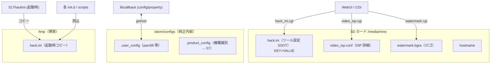
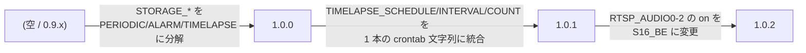

# 06. 設定管理

> **この文書が答える問い**: 設定はどこに保存され、いつ読まれ、変更はどう反映・移行されるのか？
> **前提として読む文書**: [05. WebUI データフロー](./05-webui-dataflow.md)（保存の 2 経路）
> **関連する既存文書**: [`../README.md`](../README.md)（各設定項目のユーザー向け意味）, [`../web/source/vue/Setting.vue`](../web/source/vue/Setting.vue)（**hack.ini 全キーの一次定義**）

各設定項目が「ユーザーにとって何を意味するか」は [`../README.md`](../README.md) の「Web設定画面」に詳しい。本書は**保存先・読み込みタイミング・移行・反映の仕組み**に集中する。

---

## 1. 設定ストアの全体像

設定は 1 ファイルに集約されているわけではなく、性質ごとに複数のストアに分かれる。

| ストア | パス | フォーマット | 読み書き主体 | 永続 |
|---|---|---|---|---|
| ツール設定（SSOT） | `/media/mmc/hack.ini` | `KEY=VALUE` | WebUI(`hack_ini.cgi`) 書き / init.d・scripts 読み | 永続 |
| ツール設定（実行時） | `/tmp/hack.ini` | 同上 | `S17hackini` が起動時にコピー | 揮発 |
| ISP 詳細 | `/media/mmc/video_isp.conf` | `ver=` + `key=value` | `video_isp.cgi` | 永続 |
| ロゴ | `/media/mmc/watermark.bgra` | 8B ヘッダ + BGRA raw | `watermark.cgi` | 永続 |
| 純正内部設定 | `/atom/configs/.user_config` | 純正形式 | libcallback / webcmd.sh（awk 書換） | 永続 |
| 機種識別 | `/atom/configs/.product_config` | `PRODUCT_MODEL=...` | 読み取りのみ（[07](./07-device-variants.md)） | 純正 |

`.user_config` は pan/tilt の `slide_x/y`・`horSwitch/verSwitch` 等を持ち、libcallback の `config`/`property` コマンド（[04](./04-libcallback-injection.md)）で内部変数を触るが、**libcallback 経由の変更は揮発性**（メモリ上のみ）なので、永続化するには webcmd.sh が `.user_config` ファイルを awk で書き換える（[05](./05-webui-dataflow.md) の `flip`/`posrec`）。

---

## 2. hack.ini キー・リファレンス

**hack.ini の全キーの唯一の実質的な定義は [`../web/source/vue/Setting.vue`](../web/source/vue/Setting.vue) の `config{}`（435-526 行）である。**デフォルト値・型・スキーマバージョン（`CONFIG_VER`）はここが一次情報源。各キーのユーザー向け意味は [`../README.md`](../README.md) を参照。

カテゴリ別の主なキー群（2026 年時点、`CONFIG_VER=1.0.1`）:

| カテゴリ | 主なキー |
|---|---|
| メタ情報 | `CONFIG_VER`, `appver`, `ATOMHACKVER`, `PRODUCT_MODEL`, `HOSTNAME`, `HWADDR`, `DIGEST`(WebUI 認証) |
| 再起動 | `REBOOT`, `REBOOT_SCHEDULE`(crontab 形式) |
| RTSP 配信 | `RTSP_VIDEO0-2`, `RTSP_AUDIO0-2`, `RTSP_OVER_HTTP`, `RTSP_AUTH`, `RTSP_USER`, `RTSP_PASSWD` |
| HomeKit | `HOMEKIT_ENABLE`, `HOMEKIT_SETUP_ID`, `HOMEKIT_DEVICE_ID`, `HOMEKIT_PIN`, `HOMEKIT_SOURCE` |
| 配信 | `RTMP_ENABLE`, `RTMP_URL`, `RTMP_RESTART`, `WEBRTC_ENABLE` |
| 連続録画 | `PERIODICREC_SDCARD*`, `PERIODICREC_CIFS*`, `PERIODICREC_SCHEDULE*`, `PERIODICREC_SKIP_JPEG` |
| 検知録画 | `ALARMREC_SDCARD*`, `ALARMREC_CIFS*`, `ALARMREC_SCHEDULE*` |
| タイムラプス | `TIMELAPSE_SDCARD*`, `TIMELAPSE_CIFS*`, `TIMELAPSE_SCHEDULE`, `TIMELAPSE_FPS` |
| NAS/共有 | `STORAGE_SDCARD_PUBLISH`, `STORAGE_SDCARD_DIRECT_WRITE`, `STORAGE_CIFSSERVER`, `STORAGE_CIFSUSER`, `STORAGE_CIFSPASSWD` |
| WebHook | `WEBHOOK_URL`, `WEBHOOK_INSECURE`, `WEBHOOK_ALARM_*`, `WEBHOOK_RECORD_EVENT`, `WEBHOOK_TIMELAPSE_*` |
| Swing | `CRUISE`, `CRUISE_LIST` |
| 監視/更新 | `MONITORING_NETWORK`, `MONITORING_REBOOT`, `HEALTHCHECK*`, `CUSTOM_ZIP`, `CUSTOM_ZIP_URL` |
| 映像品質 | `FRAMERATE`, `BITRATE_MAIN_AVC`(ch0), `BITRATE_SUB_HEVC`(ch1), `BITRATE_MAIN_HEVC`(ch3), `MINIMIZE_ALARM_CYCLE`, `AWS_VIDEO_DISABLE` |

> ビットレート系は負値が「auto」を意味する（`Setting.vue:523-525` のコメント参照）。

---

## 3. CONFIG_VER によるマイグレーション

`hack.ini` のスキーマは `CONFIG_VER` で管理され、古い版の ini は起動時に自動変換される。実装は [`../overlay_rootfs/scripts/hack_ini_reconfig.sh`](../overlay_rootfs/scripts/hack_ini_reconfig.sh)（[03](./03-boot-sequence.md) の `S17hackini` が起動）。

各段は `${HACK_INI}_<旧版>.bak` にバックアップを取ってから awk で変換する（`hack_ini_reconfig.sh:10,97,141`）。`video_isp.conf` も同様に `ver=` を見て `aeitmax` を移行する（`:168-186`）。

**新しいキーを追加してスキーマを変える場合は、この awk 変換段を 1 つ足し、`CONFIG_VER` を上げる**のが正しい手順。

---

## 4. 保存フロー — Submit() の差分送信

WebUI の保存ボタンは、[`../web/source/vue/Setting.vue`](../web/source/vue/Setting.vue) の `Submit()`（1267 行〜）で処理される。ポイントは **「全体保存」と「差分反映」の二段構え**。

1. 起動時に `oldConfig` を CGI から読み込み（`:683`）、`config` はそのコピーとして初期化される（`:688`）。ユーザーの編集は `config` 側に溜まる。
2. `Submit()` はまずスケジュール類（`TIMELAPSE_SCHEDULE`/`REBOOT_SCHEDULE`/`CRUISE_LIST`）を crontab 文字列へ整形。
3. `hack_ini.cgi` に **`config` 全体を POST 保存**（[05](./05-webui-dataflow.md) 経路）。
4. **`oldConfig` と `config` を項目ごとに比較し、変わったものだけ `execCmds` にコマンドを積む**（`:1367` 以降）。例:

| 変化した項目 | 発行コマンド |
|---|---|
| `TIMELAPSE_SCHEDULE`/`REBOOT_SCHEDULE` | `setCron` |
| `STORAGE_SDCARD*` | `mp4write <periodic> <alarm>` |
| `FRAMERATE` | `framerate <n\|auto>` |
| `BITRATE_MAIN_AVC/SUB_HEVC/MAIN_HEVC` | `bitrate <ch> <n\|auto>` |
| `HOSTNAME` | `hostname <name>`（＋接続先の張り替え） |
| RTSP/配信系 | `rtspserver restart` 等 |
| `DIGEST`(認証) | `lighttpd`（再起動） |

これらは `Exec(cmd, port)` で発行され、port=`socket` なら libcallback 直（経路 A）、それ以外は webcmd.sh（経路 B）へ振り分けられる（[05](./05-webui-dataflow.md)）。**全体をファイルに書きつつ、必要な項目だけを走行中のシステムへ即時反映する**のがこの設計の狙い。

> カメラ設定タブ（ISP/property 系）は Submit を持たず、トグルした瞬間に反映される（`Setting.vue:979-1027`）。多くは `Exec(..., 'socket')` で libcallback 直（経路 A）だが、flip のように `Exec('flip ...')` で webcmd.sh 経由（経路 B）を通り `.user_config` 書き換えを伴うものもある。

---

## 5. 設定を 1 つ追加する開発者向けチェックリスト

新しい設定項目を「WebUI で編集 → hack.ini 保存 → 実機反映」まで通すには、次を一気通貫で触る。

1. **フロント定義**: `Setting.vue` の `config{}`（435-526 行）にキーとデフォルト値を追加。
2. **画面**: `Setting.vue` の該当タブに `SettingSwitch`/`SettingInput` 等のコンポーネントを追加。
3. **i18n**: `web/source/vue/i18n-ja.yaml` / `i18n-en.yaml` にラベルを追加。
4. **反映コマンド**（即時反映が要る場合）: `Submit()` の差分ブロック（`:1367`〜）に `oldConfig` 比較と `execCmds.push(...)` を追加。
5. **実行系**: そのコマンドの受け手を用意 —— 特権操作なら [`../overlay_rootfs/scripts/webcmd.sh`](../overlay_rootfs/scripts/webcmd.sh) に分岐追加、カメラ制御なら libcallback にコマンド追加（[04](./04-libcallback-injection.md) の「新しいフックを追加するには」）。
6. **起動時反映**: 起動時にも効かせるなら、対応する `init.d`/`scripts`（例 `set_icamera_config.sh`）で `/tmp/hack.ini` を読んで適用。
7. **マイグレーション**（スキーマ変更時）: `hack_ini_reconfig.sh` に変換段を追加し `CONFIG_VER` を上げる。

---

## 次に読む

- 機種ごとに設定・挙動がどう変わるか → [07. 機種差分](./07-device-variants.md)
