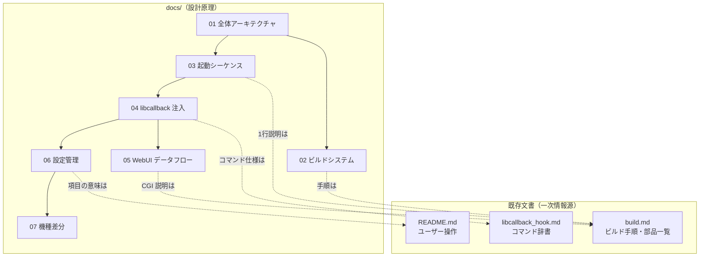

# atomcam_tools 開発者向けアーキテクチャ文書

このディレクトリは、**atomcam_tools を改造・機能追加したい開発者**のための設計文書群です。「純正ファームウェアを書き換えずに SD カードから機能を注入する」という本プロジェクトの設計原理と、コンポーネント同士の繋がりを、図とコード参照付きで解説します。

> 各機能の**使い方**を知りたいエンドユーザーは、まず [`../README.md`](../README.md) を読んでください。本 docs はその先の「仕組み」を扱います。

---

## 既存文書との住み分け

本 docs 群は既存文書と重複しないよう、役割を分けています。個々の項目の一次情報源は既存文書側にあり、docs はそこへリンクします。

| 文書 | 役割 | 粒度 |
|---|---|---|
| [`../README.md`](../README.md) | エンドユーザー向け操作説明・全機能一覧・対応 FW | 「何ができるか / どう使うか」 |
| [`../build.md`](../build.md) | ビルドコマンドの逐語手順、各 init.d/scripts/CGI の 1 行説明 | 「手順・一覧」 |
| [`../libcallback/libcallback_hook.md`](../libcallback/libcallback_hook.md) | libcallback 各モジュールのコマンド書式・hook point | 「コマンド辞書」 |
| **本 docs/** | 設計原理・コンポーネントの繋がり・技術手法・図 | **「なぜ / どう組み合わさるか」** |



---

## ファイル一覧

| # | 文書 | 内容 |
|---|---|---|
| 01 | [全体アーキテクチャ](./01-architecture.md) | 二段構え設計 / glibc・uClibc 二重 libc / リポジトリ⇔実機パス / 実行主体と権限 |
| 02 | [ビルドシステム](./02-build-system.md) | Buildroot + crosstool-NG のビルド内部フロー / 成果物 4 ファイルの生成 |
| 03 | [起動シーケンス](./03-boot-sequence.md) | initramfs → switch_root → init.d 連鎖 → chroot → LD_PRELOAD iCamera_app |
| 04 | [libcallback による機能注入](./04-libcallback-injection.md) | LD_PRELOAD の 5 フック技法 / port 4000 コマンドサーバ / 技法マトリクス |
| 05 | [WebUI データフロー](./05-webui-dataflow.md) | Vue → CGI → libcallback/FIFO の 3 層 / 権限境界の突破 |
| 06 | [設定管理](./06-configuration.md) | 設定ストア構成 / hack.ini キー / CONFIG_VER 移行 / Submit 差分送信 |
| 07 | [機種差分](./07-device-variants.md) | AtomCam / AtomSwing / WyzeCamV3 の分岐マトリクス（参照テーブル） |

---

## 推奨読破順

```text
../README.md（既存・全体像をつかむ）
  └─ 01 全体アーキテクチャ      ← 設計思想と二段構え/二重 libc（必読の土台）
       ├─ 02 ビルドシステム     ← 成果物がどう作られるか
       └─ 03 起動シーケンス     ← 成果物がどう起動し隔離環境を作るか
            └─ 04 libcallback 注入 ← 隔離の上で機能をどう注入するか（技術の核）
                 ├─ 05 WebUI データフロー ← 注入機能を UI からどう叩くか
                 └─ 06 設定管理          ← 設定がどこに保存され反映されるか
                      └─ 07 機種差分      ← 随時参照する辞書
```

- **改造したい開発者の最短経路**: **01 → 03 → 04**。この 3 本で「隔離 + 注入」の全体像がつかめます。
- **07 機種差分**は通読対象ではなく、01/03/04/06 から随時引く参照テーブルです。

---

## 用語集

| 用語 | 意味 |
|---|---|
| **二段構え** | ①カーネル/initramfs を差し替えて SD カードの rootfs を起動し、②純正システムを `/atom` に chroot 隔離して機能注入する、という 2 段階の設計（[01](./01-architecture.md)） |
| **二重 libc** | 外側 rootfs が glibc、内側の純正 `iCamera_app` が uClibc という 2 種類の C ライブラリ同居構成。libcallback は uClibc 側でビルドする（[01](./01-architecture.md)/[02](./02-build-system.md)） |
| **`/atom`** | chroot で隔離された純正カメラシステム一式のマウント先（[03](./03-boot-sequence.md)） |
| **libcallback** | 純正 `iCamera_app` に `LD_PRELOAD` して関数を横取りするフックライブラリ。TCP 4000 でコマンドを受ける（[04](./04-libcallback-injection.md)） |
| **iCamera_app / iCamera** | 純正カメラアプリ本体。ATOM 系は `iCamera_app`、Wyze は `iCamera`（[07](./07-device-variants.md)） |
| **hack.ini** | ツール設定の単一情報源（SSOT）。`/media/mmc/hack.ini` に `KEY=VALUE` 形式で保存（[06](./06-configuration.md)） |
| **webcmd.sh** | `www-data` の CGI が実行できない特権操作を代行する root 常駐デーモン（[05](./05-webui-dataflow.md)） |
| **成果物 4 ファイル** | `factory_t31_ZMC6tiIDQN`（カーネル+initramfs）/ `rootfs_hack.squashfs` / `hostname` / `authorized_keys`（[02](./02-build-system.md)） |
